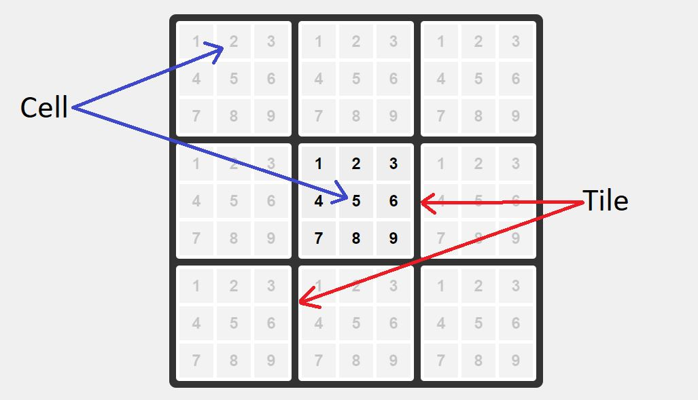

# Super Tic-Tac-Toe

This application was inspired by a game I would play inbetween classes.

## How To Play

The game is played on a 3x3 grid of 3x3 Tic-Tac-Tie boards.

The first player will start by placing their X on any cell in the center tile.

The next player takes their turn in the tile that corresponds to the cell the previous player played in.

For example, if player 'X' starts their turn by playing in the top left cell, then player 'O' has to play in the top left tile:

Once 3 cells in a tile have been taken in a row, the tile becomes either an 'X' or 'O' based on which player took it.

Getting 3 tiles of the same letter in a row wins the game!

The game is meant to be played locally with someone in person, or to be streamed to someone else (hence the numbers in the cells for convience). I am currently working on an online version. In the meantime, you can find the local version here: [Super Tic-Tac-Toe](https://david-weaving.github.io/super_tic_tac_toe/)
